<div align="center">
    <h1>Typora Plugin</h1>
    
    <p align="center">
        <a href="https://github.com/obgnail/typora_plugin/releases/latest"></a>
        <a href="https://github.com/obgnail/typora_plugin/stargazers"></a>
        <a href="https://github.com/obgnail/typora_plugin/issues"></a>
        <a href="https://github.com/obgnail/typora_plugin/tree/master/plugin"></a>
        <a href="https://github.com/obgnail/typora_plugin?tab=readme-ov-file#%E5%A6%82%E4%BD%95%E4%BD%BF%E7%94%A8%E6%96%B9%E6%B3%95%E4%B8%80%E8%87%AA%E5%8A%A8"></a>
        <a href="https://github.com/obgnail/typora_plugin/blob/master/LICENSE"></a>
    </p>
</div>

## 1.插件梳理

```mermaid
graph LR
cjtj["插件统计"] 

cjtj --> bjms["编辑模式"]
		 bjms --> bqms["标签模式(window_tab)"]
		 bjms --> zdms["只读模式(read_only)"]
		 bjms --> mhms["模糊模式(blur)"]
		 bjms --> yjms["夜间模式(dark)"]
		 bjms --> wtms["无图模式(no_image)"]
		 bjms --> jyms["记忆模式(reopenClosedFiles)"]

cjtj --> zdgn["折叠功能"]
         zdgn --> zjzd["章节折叠(collapse_paragraph)"]
         zdgn --> lbzd["列表折叠(collapse_list)"]
         zdgn --> bgzd["表格折叠(collapse_table)"]
         
cjtj --> wbcz["文本操作"]
		 wbcz --> hpyh["混排优化(md_padding)"]
		 wbcz --> gsjc["格式检查(markdownLint)"]
		 wbcz --> zfbq["中符补全(chineseSymbolAutoPairer)"]
		 wbcz --> wzfg["文字风格(text_stylize)"]
		 wbcz --> ycdl["隐藏段落(truncate_text)"]
		 wbcz --> bjgj["编辑工具(easy_modify)"]
		 wbcz --> xgzl["斜杠指令(slash_commands)"]

cjtj --> wjgl["文件管理"]
		 wjgl --> wjmb["文件模板(templater)"]
		 wjgl --> wjjm["文件加密(cipher)"]
		 wjgl --> wjsl["文件数量(file_counter)"]
         wjgl --> wjql["文件清理(resourceOperation)"]

cjtj --> ksss["快速搜索"]
         ksss --> dyss["多元搜索(search_multi)"]
		 ksss --> gnss["功能搜索(toolbar)"]
		 ksss --> hsss["行式搜索(ripgrep)"]
		
cjtj --> zqcj["增强插件"]
 		 zqcj --> mkjq["码块加强(fence_enhance)"]
 		 zqcj --> bgjq["表格加强(datatables、resize_table)"]
 		 zqcj --> tpjq["图片加强(imageReviewer、resize_image)"]
 		 zqcj --> bljq["并列加强(blockSideBySide)"]
 		 zqcj --> kdjq["宽度加强(editor_width_slider)"]
 		 zqcj --> dcjq["导出加强(export_enhance)"]
 		 zqcj --> bhjq["编号加强(auto_number)"]
         zqcj --> mljq["目录加强(toc)"]
         zqcj --> twjq["头尾加强(go_top)"]               
 		 
cjtj --> tzzj["拓展组件"]
     	 tzzj --> nthz["脑图绘制(markmap)"]
     	 tzzj --> pttb["普通图表(chart)"]
     	 tzzj --> zqtb["增强图表(echarts)"]
     	 tzzj --> yyzj["标注组件(callouts)"]
     	 tzzj --> lczj["流程组件(drawIO)"]
     	 tzzj --> ypzj["乐谱组件(abc)"]
     	 tzzj --> sxzj["时序组件(wavedrom)"]
     	 tzzj --> rlzj["日历组件(calendar)"]
     	 tzzj --> hdzj["幻灯组件(marp)"]
     	 tzzj --> sjzj["时线组件(timeline)"]
     	 tzzj --> ltzj["聊天组件(chat)"]
     	 tzzj --> kbzj["看板组件(kanban)"]

cjtj --> gjyf["高级用法"]
         gjyf --> zdzj["自定插件(custom)"]
         gjyf --> kjzc["快捷注册(hotkeys)"]
         gjyf --> gnan["功能按钮(quickButton)"]
         gjyf --> wbfw["外部服务(json_rpc)"]
         gjyf --> bksc["博客上传(article_uploader)"]
         gjyf --> lmtf["命令提符(commander)"]
         gjyf --> cjpz["插件配置(preferences)"]
         gjyf --> ypkj["圆盘控件(pie_menu)"]
         gjyf --> yjcd["右键菜单(right_click_menu)"]
         gjyf --> yhbz["用户帮助(help)"]
         gjyf --> sjcj["升级插件(updater)"]
         gjyf --> sqgl["书签管理(scrollBookmarker)"]
         gjyf --> cdzg["重定资根(redirectLocalRootUrl)"]
 
```



## 2.安装教程

前往 [视频安装教程](https://github.com/obgnail/typora_plugin/issues/847)

1. [下载](https://github.com/obgnail/typora_plugin/releases/latest) 插件源码的压缩包，并解压

2. 进入 Typora 安装路径，找到包含 `window.html` 的文件夹 A

   - 正式版 Typora，路径为 `./resources/window.html`

   - 免费版 Typora，路径为 `./resources/app/window.html`

3. 将解压得到的 plugin 文件夹粘贴进文件夹 A 下

4. 进入文件夹 `A/plugin/bin/`

   - Windows 系统：双击运行 `install_windows_amd_x64.exe`，如果看到下图，说明安装成功
   
   - Linux 系统：以管理员运行 `install_linux.sh`，如果看到下图，说明安装成功

5. 验证：重启 Typora，在正文区域点击鼠标右键，弹出右键菜单栏，如果能看到 `常用插件` 栏目，说明一切顺利

|          | 正式版                                       | 免费版                                       |
| -------- | -------------------------------------------- | -------------------------------------------- |
| 步骤 2-3 |  |  |

|        | Windows                                        | Linux                                      |
| ------ | ---------------------------------------------- | ------------------------------------------ |
| 步骤 4 |  |  |

> Windows 系统也可以通过执行 `install_windows.ps1` 安装插件；同理，Linux 系统也可以执行 `install_linux_amd_x64` 文件


> 目前此方法仅限 archlinux 平台，aur 见 [aur/typora-plugin](https://aur.archlinux.org/packages/typora-plugin)

```sh
yay -S typora-plugin
```

## 3.一些问题

### 我的 Typora 版本能用吗？

所有插件都在 0.9.98 版本（最后一个免费版本）和最新版本测试过。本项目理论上支持所有 Typora 版本，但 Typora 在 0.9.98 版本后功能才稳定下来。**0.9.98 之前的版本不推荐使用。**

### 插件会失效吗？

理论上能保持长时间有效，且我在维护中。

### 如何修改插件配置？

项目包含 600+ 配置选项，可以比较完整定义各个插件的行为。

右键菜单 -> 少用插件 -> 插件配置。

### 如何升级插件？

右键菜单 -> 常用插件 -> 二级插件 -> 升级插件。

### 我不想用了，如何卸载插件系统？

右键菜单 -> 少用插件 -> 帮助 -> 卸载插件。

### 支持 Typora for Mac 吗？

没有 Mac 设备，故没做测试。
